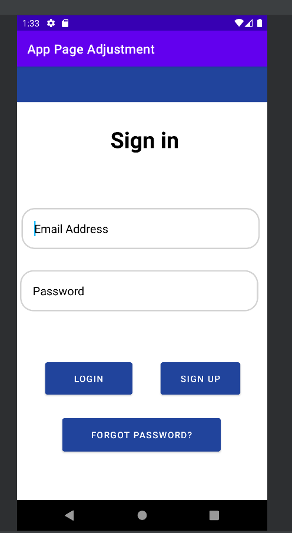

# Android Event App

## Introduction
Welcome to the Android App! The primary purpose of the app is to allow the user to monitor, add, or remove apps. Originally, it was created and mainly functioned as a display then an interactive piece. Now, the user is able to login into the app through Firebase and navigate the app in order to add or remove events froma list. Along with view account information within the settings page. 

## Table of Contents
- Instructions
- Databases
- Software Engineering
- Algorithms and Data Structures

## Instructions
- In order to navigate this app, the user must first register with the application before being able to reach the navigation pages. 
- The register page will ask for:
  - Full Name
  - Email
  - Password
- Submit this information in order to create an account. "Sign up" successful will appear and then you may log in and out of the app. 

### Databases
  The main database used within this app is Firebase. In this case, Firebase is being utilized in order to store user credentials. This allows the user to enter and exit the application along with restore credentials. 
  
# Login 
 -Logging into the app allows the user to access the features of this app. This is tied into Firebase so all information entered will be stored within the database for future usage. This allows the user to log in and out of this app with the credentials that they had entered into the system. 
 -Original Code from Login Features without Firebase
 
 
 
 
 -Enhanced code from Login Feature with Firebase
<p align="center">
  
</p>
 
```markdown
//User clicks the login_button in attempt to login to the application
        login_Button.setOnClickListener(new View.OnClickListener() {
            @Override
            public void onClick(View view) {
                //extract and validate com.example.apppageadjustment.ui.data
               if(username.getText().toString().isEmpty()) {
                   username.setError("Please enter Email");
                   return;
               }
               if(password.getText().toString().isEmpty()) {
                   username.setError("Please enter password");
                   return;
               }
                //com.example.apppageadjustment.ui.data is valid
                //login user

                firebaseAuth.signInWithEmailAndPassword(username.getText()
                        .toString(),password.getText()
                        .toString())
                        .addOnSuccessListener(new OnSuccessListener<AuthResult>() {
                    @Override
                    public void onSuccess(AuthResult authResult) {
                        startActivity(new Intent(getApplicationContext(),Bot_Nav.class));

                    }
                }).addOnFailureListener(new OnFailureListener() {
                    @Override
                    public void onFailure(@NonNull Exception e) {
                        Toast.makeText(Login.this, e.getMessage(), Toast.LENGTH_SHORT).show();
                    }
                });
            }

        });
```
# Forgot Password
  - User forgot credentials to get into the application. Click the forgot password button. If the user email is a valid address then an email notification will be sent to the user to enter a new password. 
  ```markdown
Syntax highlighted code block

# Header 1
## Header 2
### Header 3

- Bulleted
- List

1. Numbered
2. List

**Bold** and _Italic_ and `Code` text

[Link](url) and 
```  
# Register
  - User must enter the sign up page first in order to get full functionality of the application. 

  ```markdown
Syntax highlighted code block

# Header 1
## Header 2
### Header 3

- Bulleted
- List

1. Numbered
2. List

**Bold** and _Italic_ and `Code` text

[Link](url) and 
```  


### Software Engineering

```markdown
Syntax highlighted code block

# Header 1
## Header 2
### Header 3

- Bulleted
- List

1. Numbered
2. List

**Bold** and _Italic_ and `Code` text

[Link](url) and 
```


### Algorithms and Data Structures
```markdown
Syntax highlighted code block

# Header 1
## Header 2
### Header 3

- Bulleted
- List

1. Numbered
2. List

**Bold** and _Italic_ and `Code` text

[Link](url) and 
```


### Support or Contact

Having trouble with Pages? Check out our [documentation](https://docs.github.com/categories/github-pages-basics/) or [contact support](https://support.github.com/contact) and we’ll help you sort it out.

