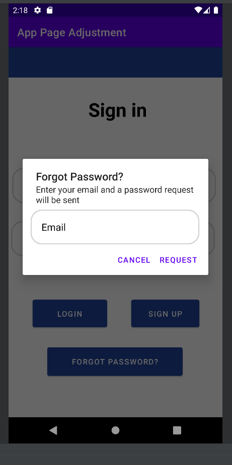

# Android Event App

## Introduction
Welcome to the Android App! The primary purpose of the app is to allow the user to monitor, add, or remove events. Originally, it was created and mainly functioned as a display then an interactive piece. Now, the user is able to login into the app through Firebase and navigate the app in order to add or remove events from a list. Along with view account information within the settings page. 

## Table of Contents
- Instructions
- Databases
- Register
- Login
- Forgot Password
- Home Page
- Favorites Page
- Settings

## Instructions
- In order to navigate this app, the user must first register with the application before being able to reach the navigation pages. 
- The register page will ask for:
  - Full Name
  - Email
  - Password
- Submit this information in order to create an account. "Sign up" successful will appear and then you may log in and out of the app. 

# Databases
  The main database used within this app is Firebase. In this case, Firebase is being utilized in order to store user credentials. This allows the user to enter and exit the application along with restore credentials. The usage of firebase also aids in increasing security around user logins. 
  Additionally, SQLite is also being utilized for storing event information, but is not functional at this point in time within the files. 
  
# Register
  - User must enter the sign up page first in order to get full functionality of the application. 
  - Enter all credentials in order to gain access to the apps features
  - If fields are not filled out or passwords do not match the user will not be able to sign up

## Register.class Before Enhancements
- Did not originally store user credentials
- Buttons would exit, but not submit

<p align="center">
  
</p>

```markdown
public class Register extends AppCompatActivity {
//Should get called to the second screen and display the dashboard
    @Override
    protected void onCreate(Bundle savedInstanceState) {
        super.onCreate(savedInstanceState);
        setContentView(R.layout.activity_register);
    }
}
``` 
## Register.class After Enhancements
- Register class now logs the information that is entered into it
- Submit and cancel buttons navigate the user to the appropriate page
- If credentials are not met, the user cannot create an account


<p align="center">
  
</p>


  ```markdown
@Override
            public void onClick(View view) {
                //Extract com.example.apppageadjustment.ui.data
                String fullName = registerName.getText().toString();
                String emailAddress = registerEmail.getText().toString();
                String password = registerPassword.getText().toString();
                String password2 = registerPassword2.getText().toString();
                //Warn the user if the text fields are empty to fill out the following information
                if (fullName.isEmpty()) {
                    registerName.setError("Must Enter a name");
                    return;
                }
                if (emailAddress.isEmpty()) {
                    registerEmail.setError("Must Enter a Email");
                    return;
                }
                if (password.isEmpty()) {
                    registerPassword.setError("Must Enter a Password");
                    return;
                }
                if (password2.isEmpty()) {
                    registerPassword2.setError("Must Enter a Password again");
                    return;
                }

                //Password dont match currently
                if (!password.equals(password2)) {
                    registerPassword2.setError("Passwords do not match, try again");
                } else {
                    //passed, place toast message here to say it passed
                }

                fAuth.createUserWithEmailAndPassword(emailAddress,password).addOnSuccessListener(new OnSuccessListener<AuthResult>() {
                    @Override
                    public void onSuccess(AuthResult authResult) {
                    //Successful user is at the next page
                        signup();
                    }

```   

## Example code from activity_register.xml

  ```markdown

<!--First Name of User-->
  <EditText
      android:id="@+id/register_Name"
      android:layout_width="332dp"
      android:layout_height="54dp"
      android:background="@drawable/edit_text_bg"
      android:hint="Full Name"
      android:paddingLeft="20dp"
      android:paddingTop="10dp"
      android:paddingBottom="10dp"
      app:layout_constraintBottom_toBottomOf="parent"
      app:layout_constraintEnd_toEndOf="parent"
      app:layout_constraintHorizontal_bias="0.493"
      app:layout_constraintStart_toStartOf="parent"
      app:layout_constraintTop_toTopOf="parent"
      app:layout_constraintVertical_bias="0.324"
      app:layout_constraintWidth_percent=".8" />
```   


- Link to Enhanced Code: [Register](AndroidEnhancement.zip)
- Register.class: AndroidEnhancement.zip\AndroidEnhance\app\src\main\java\com\example\apppageadjustment\Register
- activity_login.XML: AndroidEnhancement.zip\AndroidEnhance\app\src\main\res\layout\activity_register.xml  
  

# Login 
 - Logging into the app allows the user to access the features of this app. This is tied into Firebase so all information entered will be stored within the database for future usage. This allows the user to log in and out of this app with the credentials that they had entered into the system. 
 - 
## Login.class Before Enhancements
- Login feature did not work properly, originally having errors where the user code log in without entering data
- No security was implemented to store or maintain user information

 <p align="center">
  
</p>

```markdown

 loginViewModel.getLoginFormState().observe(this, new Observer<LoginFormState>() {
            @Override
            public void onChanged(@Nullable LoginFormState loginFormState) {
                if (loginFormState == null) {
                    return;
                }
                loginButton.setEnabled(loginFormState.isDataValid());
                if (loginFormState.getUsernameError() != null) {
                    usernameEditText.setError(getString(loginFormState.getUsernameError()));
                }
                if (loginFormState.getPasswordError() != null) {
                    passwordEditText.setError(getString(loginFormState.getPasswordError()));
                }
            }

        });
```


# Login.class After Enhancements
- Firebase was included to maintain and secure user input
- User can now log in or out at any time while their information is being stored in firebase
- Buttons (such as sign up and forgot password are also reachable within the code)

<p align="center">
  
</p>
 
```markdown
//User clicks the login_button in attempt to login to the application
        login_Button.setOnClickListener(new View.OnClickListener() {
            @Override
            public void onClick(View view) {
                //extract and validate com.example.apppageadjustment.ui.data
               if(username.getText().toString().isEmpty()) {
                   username.setError("Please enter Email");
                   return;
               }
               if(password.getText().toString().isEmpty()) {
                   username.setError("Please enter password");
                   return;
               }
                //com.example.apppageadjustment.ui.data is valid
                //login user

                firebaseAuth.signInWithEmailAndPassword(username.getText()
                        .toString(),password.getText()
                        .toString())
                        .addOnSuccessListener(new OnSuccessListener<AuthResult>() {
                    @Override
                    public void onSuccess(AuthResult authResult) {
                        startActivity(new Intent(getApplicationContext(),Bot_Nav.class));

                    }
                }).addOnFailureListener(new OnFailureListener() {
                    @Override
                    public void onFailure(@NonNull Exception e) {
                        Toast.makeText(Login.this, e.getMessage(), Toast.LENGTH_SHORT).show();
                    }
                });
            }

        });
```


## Example xml code from activity_login.xml

```markdown
<!--Email or username edit text for the user to enter information-->
    <EditText
        android:id="@+id/username"
        android:layout_width="402dp"
        android:layout_height="wrap_content"
        android:layout_below="@+id/toolbar3"
        android:layout_alignParentStart="true"
        android:layout_alignParentEnd="true"
        android:layout_marginStart="7dp"
        android:layout_marginTop="107dp"
        android:layout_marginEnd="12dp"
        android:layout_marginBottom="10dp"
        android:background="@drawable/edit_text_bg"
        android:drawablePadding="20dp"
        android:hint="Email Address"
        android:padding="20dp"
        android:textColor="@color/black"
        android:textColorHint="@color/black" />
```

- Link to Login Code: [Login](AndroidEnhancement.zip)
- Login.class: AndroidEnhancement.zip\AndroidEnhance\app\src\main\java\com\example\apppageadjustment\Login
- activity_login.XML: AndroidEnhancement.zip\AndroidEnhance\app\src\main\res\layout\activity_login.xml  

# Forgot Password
  - User forgot credentials to get into the application. Click the forgot password button. If the user email is a valid address then an email notification will be sent to the user to enter a new password. 

# Forgot Password Features Before Enhancements
- No available code, this feature was just a display 

# Forgot Password Features After Enhancements
-Request button will send the user a link to reset the password to the account

<p align="center">
  
</p>
 
  ```markdown
private void forgotPassword() {
        View view = inflater.inflate(R.layout.activity_forgot_password,null);
        resetAlert.setTitle("Forgot Password?")
                .setMessage("Enter your email and a password request will be sent")
                .setPositiveButton("Request", new DialogInterface.OnClickListener() {
                    @Override
                    public void onClick(DialogInterface dialogInterface, int which) {
                        //Validate email address
                        EditText email = view.findViewById(R.id.email);
                        if(email.getText().toString().isEmpty()){
                            email.setError("Required field");
                            return;
                        }

                        firebaseAuth.sendPasswordResetEmail(email.getText().toString()).addOnSuccessListener(new OnSuccessListener<Void>() {
                            @Override
                            public void onSuccess(Void unused) {
                                Toast.makeText(Login.this, "Request Sent",Toast.LENGTH_SHORT).show();

                            }
                        }).addOnFailureListener(new OnFailureListener() {
                            @Override
                            public void onFailure(@NonNull Exception e) {
                                Toast.makeText(Login.this, e.getMessage(),Toast.LENGTH_SHORT).show();
                            }
                        });
                        //Send reset link

                    }
                }).setNegativeButton("Cancel",null)
                .setView(view)
                .create()
                .show();
```  

# Example code from activity_forgot_password.xml

```markdown
<!--Forgot Password function, enter email to get password link-->
    <EditText
        android:id="@+id/email"
        android:layout_width="310dp"
        android:layout_height="64dp"
        android:layout_alignParentStart="true"
        android:layout_alignParentEnd="true"
        android:background="@drawable/edit_text_bg"
        android:drawablePadding="20dp"
        android:hint="Email"
        android:padding="20dp"
        android:textColor="@color/black"
        android:textColorHint="@color/black"
        app:layout_constraintBottom_toBottomOf="parent"
        app:layout_constraintEnd_toEndOf="parent"
        app:layout_constraintHorizontal_bias="0.466"
        app:layout_constraintStart_toStartOf="parent"
        app:layout_constraintTop_toTopOf="parent"
        app:layout_constraintVertical_bias="0.037" />

```  


- Link to Forgot Password: [Forgot Password](AndroidEnhancement.zip)
- Login.class: AndroidEnhancement.zip\AndroidEnhance\app\src\main\java\com\example\apppageadjustment\Login
- activity_forgot_password.XML: AndroidEnhancement.zip\AndroidEnhance\app\src\main\res\layout\activity_forgot_password.xml  


# Home Page
- Main page after logging in, user can scroll through the events available
- Favorites button is implemented on the screen but is not functional at this time

# HomeFragment.Class Features Before Enhancements
- Home page did not have event information nor did it incorporate a complex layout for future enhancements
- Display only showed vectors not actual event information

<p align="center">
  
</p>

```markdown
  private HomeViewModel homeViewModel;
    private FragmentHomeBinding binding;

    public View onCreateView(@NonNull LayoutInflater inflater,
                             ViewGroup container, Bundle savedInstanceState) {

        homeViewModel =
                new ViewModelProvider(this).get(HomeViewModel.class);

        binding = FragmentHomeBinding.inflate(inflater, container, false);
        View root = binding.getRoot();

        final TextView textView = binding.textHome;
        homeViewModel.getText().observe(getViewLifecycleOwner(), new Observer<String>() {
            @Override
            public void onChanged(@Nullable String s) {
                textView.setText(s);
            }
        });
        return root;
    }

    @Override
    public void onDestroyView() {
        super.onDestroyView();
        binding = null;
    }
}
```


# HomeFragment.Class Features After Enhancements
- Scroll view was implemented along with button to favorite events although the button is currently not operational
- Home fragment is reachable after user logs into the app
- Home fragment connects to all pages throughout the navigation bar

<p align="center">
  
</p>


```markdown
 @Override
    public View onCreateView(
            LayoutInflater inflater, ViewGroup container,
            Bundle savedInstanceState
    ) {

        View view = inflater.inflate(R.layout.fragment_home,container,false);
        recview = (RecyclerView) view.findViewById(R.id.recview);
        recview.setLayoutManager(new LinearLayoutManager(getContext()));
        dataholder = new ArrayList<EventItem>();
//Information that will placed into the array in order to display events to the users in the app
        EventItem ob1 = new EventItem(R.drawable.daughtry,R.drawable.ic_baseline_favorite_border_24,"Daughtry","Sat,Aug 27,7 PM – Sun,Aug 28,12 AM","Mount Airy Casino Resort, PA", "0","0");
        dataholder.add(ob1);

        EventItem ob2 = new EventItem(R.drawable.dreamcatcher,R.drawable.ic_baseline_favorite_border_24,"Dreamcatcher","Fri, Jul 1, 7:00 – 11:30 PM","Santander Arena   Penn St,PA", "1","0");
        dataholder.add(ob2);

        EventItem ob3 = new EventItem(R.drawable.askingalexandria,R.drawable.ic_baseline_favorite_border_24,"Asking Alexandria","Sun, June 5, 6:35pm","Agora Theatre,   Cleveland, OH", "2","0");
        dataholder.add(ob3);

        EventItem ob4 = new EventItem(R.drawable.colossalconeast,R.drawable.ic_baseline_favorite_border_24,"Colossalcon East","Fri, Sep 9, 1 PM – Sun, Sep 11, 4      PM","Kalahari Resorts Poconos, PA", "3","0");
        dataholder.add(ob4);

        EventItem ob5 = new EventItem(R.drawable.newyorkcomiccon,R.drawable.ic_baseline_favorite_border_24,"New York Comic Con","Thu,Oct 6 - Sun, Oct 9","Javits       Center", "4","0");
        dataholder.add(ob5);

        EventItem ob6 = new EventItem(R.drawable.hackathon,R.drawable.ic_baseline_favorite_border_24,"Inclusive Data Hackathon","Fri, June 17, 8:00pm","Online Event",  "5","0");
        dataholder.add(ob6);

        EventItem ob7 = new EventItem(R.drawable.sportech,R.drawable.ic_baseline_favorite_border_24,"Sports Tech Hackathon","Fri, Jul 15th – Jul 19th","Online Event", "6","0");
        dataholder.add(ob7);

        EventItem ob8 = new EventItem(R.drawable.inkcar,R.drawable.ic_baseline_favorite_border_24,"Inkcarceration 2022","Fri,July 15 - Sun, Jul 17","Mansfield, OH",   "7","0");
        dataholder.add(ob8);
        
        recview.setAdapter(new EventAdapter(dataholder));

        return view;
```
# Example code from fragment_home.xml

```markdown

    <ScrollView
        android:layout_width="match_parent"
        android:layout_height="match_parent"
        >

        <androidx.recyclerview.widget.RecyclerView
            android:id="@+id/recview"
            android:layout_width="380dp"
            android:layout_height="828dp"
            android:visibility="visible"
            app:layout_constraintBottom_toBottomOf="parent"
            app:layout_constraintEnd_toEndOf="parent"
            app:layout_constraintStart_toStartOf="parent"
            app:layout_constraintTop_toTopOf="parent" />

    </ScrollView>
```


- Link to Home Page: [Home](AndroidEnhancement.zip)
- HomeFragment.class:AndroidEnhancement.zip\AndroidEnhance\app\src\main\java\com\example\apppageadjustment\ui\home\HomeFragment
- fragment_home.XML: AndroidEnhancement.zip\AndroidEnhance\app\src\main\res\layout\fragment_home.xml


# Favorites Page
- Due to obstacles while coding this portion, this page is currently blank. With future edits, this app with be able to transfer items the user favorites on the home page and move it to the favorties page. 

# FavoritesFragment.class Before Enhancements
- fragment was not connected to any sort of database layout 
- acted more as a display 

```markdown
public View onCreateView(@NonNull LayoutInflater inflater,
                             ViewGroup container, Bundle savedInstanceState) {
        dashboardViewModel =
                new ViewModelProvider(this).get(DashboardViewModel.class);

        binding = FragmentDashboardBinding.inflate(inflater, container, false);
        View root = binding.getRoot();

        final TextView textView = binding.textDashboard;
        dashboardViewModel.getText().observe(getViewLifecycleOwner(), new Observer<String>() {
            @Override
            public void onChanged(@Nullable String s) {
                textView.setText(s);
            }
        });
        return root;
    }
```

# FavoritesFragment.class After Enhancements
- Incorporates SQLite and a list to store event information
- Not tied into the home page at this time due to inflater conflicts within the app 

```markdown
public class FavoritesFragment extends Fragment {

    private RecyclerView recyclerView;
    private FavDB favDB;
    private List<FavEvent> favEventList = new ArrayList<>();
    private FavAdapter favAdapter;


    public View onCreateView(@NonNull LayoutInflater inflater,
                             ViewGroup container, Bundle savedInstanceState) {
        View root = inflater.inflate(R.layout.fragment_favorites,container,false);

        favDB = new FavDB(getActivity());
        recyclerView = root.findViewById(R.id.recyclerView);
        recyclerView.setHasFixedSize(true);
        recyclerView.setLayoutManager(new LinearLayoutManager(getActivity()));

        loadData();

        return root;
    }
```
# Example of fragment_favorites.xml

```markdown
  <androidx.recyclerview.widget.RecyclerView
        android:id="@+id/recyclerView"
        android:layout_width="match_parent"
        android:layout_height="match_parent"
        android:paddingBottom="?attr/actionBarSize"
        android:clipToPadding="false"/>
```
- Link to Favorites Code: [Favorites](AndroidEnhancement.zip)
- FavoritesFragment.class: AppPageAdjustment\app\src\main\java\com\example\apppageadjustment\ui\dashboard\FavoritesFragment
- activity_login.XML: AndroidEnhancement.zip\AndroidEnhance\app\src\main\res\layoutfragment_favorites.xml  

# Profile Page
-The profile page displays all settings that the user can access. At this time this portion is not clickable, except for the log out button. The user may log out of the application via this page in which they will be sent back to the main page. 


# Profile Page Before Enhancements
- Was set as a permissions page originally
```markdown
@Override
        protected void onCreate(Bundle savedInstanceState) {
            super.onCreate(savedInstanceState);
            setContentView(R.layout.fragment_notifications);

            Button buttonRequest = findViewById(R.id.button);
            buttonRequest.setOnClickListener(new View.OnClickListener() {
                @Override
                public void onClick(View v) {
                    if (ContextCompat.checkSelfPermission(Permissions.this,
                            Manifest.permission.READ_EXTERNAL_STORAGE) == PackageManager.PERMISSION_GRANTED) {
                        Toast.makeText(Permissions.this, "You have already granted this permission!",
                                Toast.LENGTH_SHORT).show();
                    } else {
                        requestStoragePermission();
                    }
                }
            });
        }
```

# Profile Page After Enhancements
- Displays a variety of different options for the settings of the profile page
- The log out button is located here in order to sign out of the app (only clickable button here)

<p align="center">
  
</p>

```markdown
public class ProfileFragment extends Fragment {
    Button logoutBtn;
    private FragmentProfileBinding binding;

    public View onCreateView(@NonNull LayoutInflater inflater,
        ViewGroup container, Bundle savedInstanceState) {
        ProfileViewModel profileViewModel =
                new ViewModelProvider(this).get(ProfileViewModel.class);
        //Implement log out figure with firebase information
        View v = inflater.inflate(R.layout.fragment_profile,container, false);

        logoutBtn = v.findViewById(R.id.signoff_btn);
        
        logoutBtn.setOnClickListener(new View.OnClickListener() {
            @Override
            public void onClick(View view) {
                FirebaseAuth.getInstance().signOut();
                Intent intent = new Intent(getActivity(), Login.class);
                startActivity(intent);
            }
        });
        return v;
    }
```

# Example of fragment_profile.xml
```markdown
<!---Option 1: in settings-->
            <LinearLayout
                android:layout_width="match_parent"
                android:layout_height="wrap_content"
                android:layout_marginStart="20dp"
                android:layout_marginEnd="20dp"
                android:layout_marginTop="40dp"
                android:orientation = "vertical"
                android:padding="15dp">
                <RelativeLayout
                    android:layout_width="match_parent"
                    android:layout_height="wrap_content"
                    android:clickable="true">

                    <ImageView
                        android:id="@+id/settingoption"
                        android:layout_width="40dp"
                        android:layout_height="40dp"
                        android:contentDescription="TODO"
                        android:padding="12dp"
                        android:src="@drawable/ic_baseline_notifications_24" />

                    <TextView
                        android:layout_width="113dp"
                        android:layout_height="29dp"
                        android:layout_alignParentTop="true"
                        android:layout_alignParentEnd="true"
                        android:layout_marginStart="30dp"
                        android:layout_marginTop="10dp"
                        android:layout_marginEnd="170dp"
                        android:text="Notifications"
                        android:textColor="@color/black"
                        android:textStyle="bold" />

                    <ImageView
                        android:layout_width="40dp"
                        android:layout_height="40dp"
                        android:src = "@drawable/ic_baseline_arrow_forward_24"
                        android:layout_alignParentEnd="true"
                        android:layout_centerVertical="true"
                        android:padding="12dp"/>


                </RelativeLayout>
```

- Link to Profile Code: [Profile](AndroidEnhancement.zip)
- Profile Fragments.class: AppPageAdjustment\app\src\main\java\com\example\apppageadjustment\ui\notifications\ProfileFragment
- activity_login.XML: AndroidEnhancement.zip\AndroidEnhance\app\src\main\res\layoutfragment_profile.xml  


### Support or Contact

Having trouble with Pages? Check out our [documentation](https://docs.github.com/categories/github-pages-basics/) or [contact support](https://support.github.com/contact) and we’ll help you sort it out.

